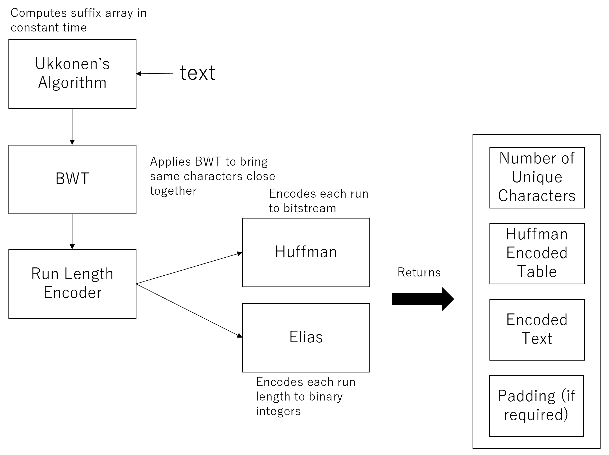

# custom-bzip

Implementation of a text encoder + decoder similar to bzip.

## How to run the program
This program consists of three scripts:
1) st2sa.py - Creates a suffix array using Ukkonen Algorithm and returns a suffix array. As an argument, it takes a filename of a target string.
2) bwtzip.py - Zips a given string input into a binary file. As an argument, it takes a filename of a target string.
3) bwtunzip.py - Unzips a zipped string using bwtzip.py. It requires the zipped string location as an argument.

## Encoder and Decoder Design
As shown below, both the encoder and decoder use several techniques to reduce the size of text efficiently. 
It first uses Ukkonen's algorithm to generate a suffix array. BWT uses this suffix array and apply L-F mapping to compute the BWT encoded text.
Now, the run length encoder, consisting of Huffman and Elias encoders, will encode the BWT encoded text to bitstreams run by run.
The final binary file starts with a number of unique characters in the text, followed by the Huffman table and the encoded text.
